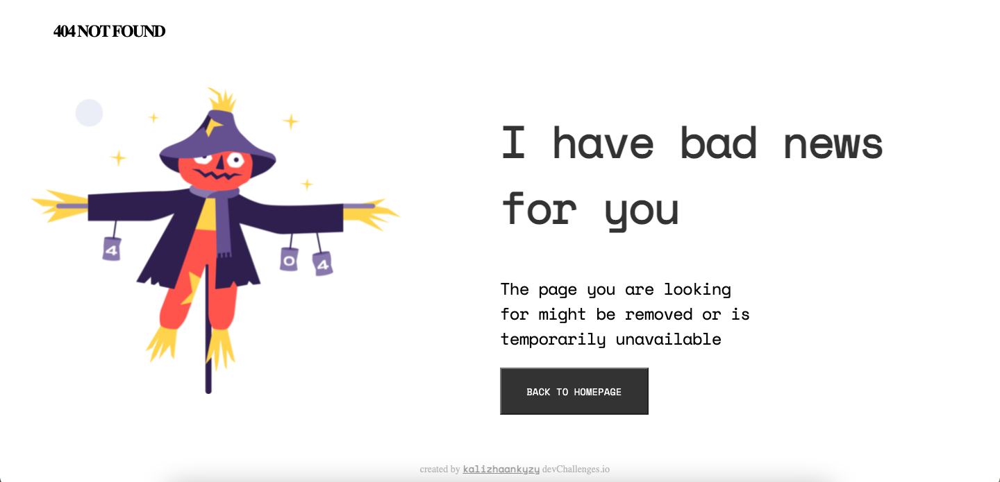

<!-- Please update value in the {}  -->

<h1 align="center">{404 NOT FOUND Page}</h1>

   Solution for a challenge from  <a href="http://devchallenges.io" target="_blank">Devchallenges.io</a>.

  <h3>
    <a href="https://kalizhaankyzy.github.io/Devchallenges/404-not-found/index.html">
      Demo
    </a>
     | 
    <a href="https://github.com/kalizhaankyzy/Devchallenges/404-not-found">
      Solution
    </a>
     | 
    <a href="https://devchallenges.io/challenges/wBunSb7FPrIepJZAg0sY">
      Challenge
    </a>
  </h3>

<!-- TABLE OF CONTENTS -->

## Table of Contents

- [Overview](#overview)
- [Features](#features)
- [Contact](#contact)

<!-- OVERVIEW -->

## Overview

My first challenge from [DevChallenges](https://devchallenges.io/challenges). I'll testing new things during challenges.

## Features

This application/site was created as a submission to a [DevChallenges](https://devchallenges.io/challenges) challenge. The [challenge](https://devchallenges.io/challenges/wBunSb7FPrIepJZAg0sY) was to build an application to complete the given user stories.

## Contact

- Website [website.com](https://kalizhaankyzy.github.io/Devchallenges/404-not-found/index.html)
- GitHub [@kalizhaankyzy](https://github.com/kalizhaankyzy/Devchallenges)
- Instagram [@kalizhaankyzy](https://{instagram.com/kalizhaankyzy)
